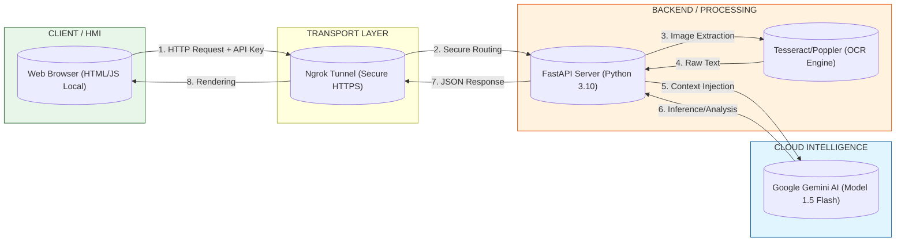

# doc-analyst


**Analysis for Technical Documentation**

## 1. Executive Overview

This solution consists of a modular web application designed for the technical analysis of engineering documents (manuals, contracts, datasheets). The system leverages Generative AI (LLM) combined with Computer Vision (OCR) to interpret unstructured PDF files.

The solution is engineered to handle the complexity of technical jargon and structured data found in industrial documentation, serving as a bridge between Operational Technology (OT) needs and Information Technology (IT) capabilities.

## 2. System Architecture

The solution architecture is defined as an **Edge-to-Cloud Layered Stateless REST Architecture** implementing a **Zero Trust** security model.

This definition relies on the following pillars:

* **Edge-to-Cloud:** The client (HMI/Browser) operates at the user's edge environment, while heavy processing and AI inference occur remotely in the cloud, bridging the gap via secure tunneling.
* **Layered (N-Tier):** There is a strict separation of concerns: Presentation (Frontend), Transport (Secure Tunnel), Processing (API/OCR), and Inference (External LLM).
* **Stateless REST Backend:** The API does not rely on persistent session states. Each request is treated as an independent atomic unit, ensuring scalability and preventing data leakage between sessions.
* **Microservice-like:** The backend acts as an independent service consumed via HTTP, orchestrating OCR and AI services without monolithic dependencies.
* **Zero Trust:** Credentials are provided on-demand per request, traffic is encrypted, and data persistence is minimized.

### Architectural Diagram



## 3. Technical Modules

3.1. Presentation Layer (Frontend)
* **Technology:** HTML5, CSS3, Vanilla JavaScript.

* **Function:** Handles user interaction and local credential management.

* **Security:** Utilizes browser localStorage to manage connection strings, ensuring no hardcoded endpoints in the source code.

3.2. Transport Layer (Tunneling)
* **Technology:** Ngrok (Secure Introspectable Tunnels).

* **Function:** Creates an encrypted HTTPS tunnel to expose the local Python backend (port 8000) to the public internet, bypassing NAT/Firewall restrictions common in industrial environments.

3.3. Processing Layer (Backend)
* **Technology:** Python 3.10+, FastAPI (ASGI), Uvicorn.

* **OCR Engine:** Integration with pytesseract and pdf2image (Poppler) to convert scanned PDFs into processable text.

* **Stateless Design:** The backend does not store API keys. Credentials must be provided with every request, adhering to Zero Trust principles.

3.4. Inference Layer
* **Model:** Google Gemini 1.5 Flash.

* **Engineering:** The system injects a "technical persona" system prompt to ensure responses are aligned with engineering vocabulary and maintenance standards.

## 4. Security Model
The architecture adopts a **Zero Trust** approach at the application layer:

1. **Agnostic Backend:** The Python server does not store master credentials.

2. **On-Demand Authentication:** The Google API Key is transmitted via encrypted headers (HTTPS), used to instantiate the AI client for the duration of the request, and immediately discarded from memory.

3. **Data Privacy:** No persistent database (SQL/NoSQL) is used. Uploaded documents exist only in volatile memory (RAM) during execution and are cleared upon task completion.

## 5. Installation & Usage

**Prerequisites**
* Python 3.10+

* Tesseract OCR installed on the host machine.

* Poppler Utils installed on the host machine.

* Google Gemini API Key.

**Setup**
1. Clone the repository and navigate to the integration folder:
```bash 
cd applied-computing/integration/doc-analyst
```

2. Install backend dependencies:
```bash 
pip install -r backend/requirements.txt
```

3. Start the FastAPI server:
```bash 
uvicorn backend.main:app --reload
```

4. Start the Ngrok tunnel (in a separate terminal):
```bash 
ngrok http 8000
```

5. Open ```bash frontend/index.html``` in your browser and configure the Ngrok URL and API Key in the settings panel.

## 6. Roadmap & Limitations
* **Ephemeral Infrastructure:** Currently relies on dynamic tunneling. Future iterations will include Docker containerization for * persistent deployment on Azure Container Apps.

* **OCR Latency:** High-resolution technical drawings may require 15-45 seconds for pre-processing.

Developed for the Digital Solutions Project.